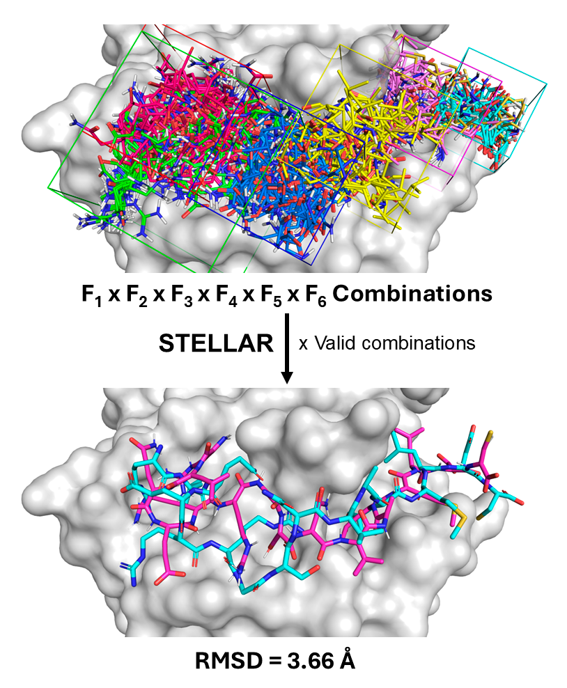

## STELLAR: Score-Tuning for Efficient ranking of Large Ligands using an Accurate and Refined docking configuration
 
[](https://doi.org/10.26434/chemrxiv-2025-nmn5s/v2)
[](https://doi.org/10.5281/zenodo.19204099)

STELLAR is a workflow that enables robust docking of large ligands, such as peptides and polysaccharides, using a fragment-based approach, and subsequently computes a range of metrics to assess the accuracy of the method




### Installation

Please first check the dependencies and configuration that you need in **DEPENDENCIES.md** before to launch the tool. 

Because STELLAR is a toolkit composed of scripts and independent folders/containers, you must deploy the bundled assets before running any workflow.

The project requires additional assets that are not stored in Git due to size limits. Download and deploy them before starting:

```bash
./fetch_assets.sh
```

This script downloads `STELLAR.tar` from Google Drive, extracts it, expands the nested `.tar` files, and deploys the resulting folders/files into the repository root.

Google Drive source:
- [STELLAR.tar](https://drive.google.com/open?id=1yjLWm5uBZqOT_6pRgnd_wXpSFjZicmvt)

### HPC note (BSC)

These calculations are prepared to run on the **BSC supercomputer environment**. If you run STELLAR on another cluster, adapt scheduler settings, module/toolchain setup, paths, and container/runtime configuration to your local infrastructure before launching production jobs.

### Usage instructions

Use this flow to generate a case-specific SLURM workflow and run it through final metrics.

Before running, ensure your project root includes:

- `GROMACS/`
- `MetaScreener/`
- `STELLAR/`
- `singularity/` with required images (for example `metascreener.simg`, `metascreener_22.04.simg`, `gr.simg`, `new_ms.simg`, `STELLAR.simg` depending on steps used)
- input data folders such as `Propedia_pdbqt_5Frag/`, `peptide_pdb_fragments/`, `complex/`

### 1) Create the workflow job for your case

Example for case `1AQD_C`:

```bash
python3 generate_workflow_job.py \
  --case 1AQD_C \
  --st-dir STELLAR \
  --job-name STELLAR_1AQD_C \
  --walltime 3-00:00:00 \
  --cpus 1 \
  --nodes 1 \
  --ntasks 1 \
  --qos gp_resa \
  --account ucam37
```

This generates:

- `job_workflow_1AQD_C.sh`
- `run_md_step_1AQD_C.sh`

### 2) Submit the workflow job

```bash
sbatch job_workflow_1AQD_C.sh
```

To resume from a specific step:

```bash
sbatch --export=START_FROM_STEP=<N> job_workflow_1AQD_C.sh
```

Example (resume at MD step):

```bash
sbatch --export=START_FROM_STEP=11 job_workflow_1AQD_C.sh
```

### 3) Monitor execution

```bash
squeue -u $USER
tail -f output_1AQD_C.out
tail -f output_1AQD_C.err
```

### 4) Main outputs

If the workflow completes successfully, key outputs are:

- Filtered combinations: `valid_combinations_GN_<CASE>/valid_no_overlap/`
- Prepared final combinations: `valid_GN_<CASE>_final/`
- Final merged metrics CSV: `all_metrics_GN_<CASE>.csv`

### Optional: use a different Propedia folder

If you want to run with another fragment set (for example `Propedia_pdbqt_6Frag`), update step 0 in the generated job to pass:

```bash
--propedia-folder Propedia_pdbqt_6Frag
```

The folder must keep the same structure (`Receptor/`, `Fragments/`, `Commands/`).


### Layout

- **Repository root (this folder):** scripts that **launch** external commands or the MD flow — `run_propedia_commands_single.py`, `run_md_simulations.py`, `sm.sh`.
- **`STELLAR/`:** all other pipeline steps (metrics, conversion, merge, topology, etc.). Invoke them from the project root, e.g. `python3 STELLAR/merge_all_metrics.py ...`.

**Deployment:** merge the contents of `STELLAR_github/` into the root of a full STELLAR checkout; do not replace the entire repository.

Scripts assume **paths relative to the project root** where `GROMACS/`, `MetaScreener/`, `singularity/`, `conversion_targets/`, `complex/`, `peptide_pdb_fragments/`, etc. coexist.

## GN pipeline (logical order)

| # | Script |
|---|--------|
| 0 | `run_propedia_commands_single.py` |
| 1 | `STELLAR/save_pose_CN_coordinates.py`, `STELLAR/aggregate_gn_pose_coords.py` |
| 2 | `STELLAR/filter_fragment_combinations` |
| 3 | `STELLAR/organize_valid_combinations.py` |
| 4 | `STELLAR/check_overlap_combinations.py` |
| 5 | `STELLAR/convert_combinations_pdbqt_to_mol2.py` |
| 6 | `STELLAR/merge_all_combinations.py` (+ `STELLAR/relax_merge_mol2.py`, `STELLAR/fix_charge_drift.py`) |
| 7 | `STELLAR/prepare_final_combinations.py` |
| 8 | `STELLAR/fix_zero_charge_atoms.py` |
| 9 | `STELLAR/generate_topologies.py` |
| 10 | `run_md_simulations.py` + `sm.sh` |
| 11 | `STELLAR/calculate_rmsd_combinations.py` |
| 12 | `STELLAR/calculate_md_rmsd.py` |
| 13 | `STELLAR/filter_valid_combinations_csv.py` |
| 14 | `STELLAR/calculate_score_only.py` |
| 15 | `STELLAR/calculate_mmpbsa.py` |
| 16 | `STELLAR/calculate_fragment_energies.py` |
| 17 | **`STELLAR/merge_all_metrics.py`** → `all_metrics_GN_<case>.csv` |

Command reference: `docs/WORKFLOW_GN_timed_reference.txt`.
